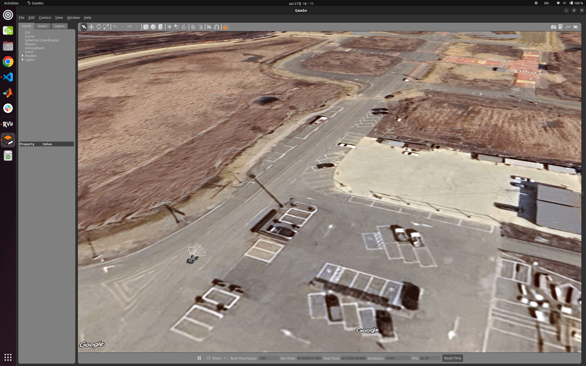
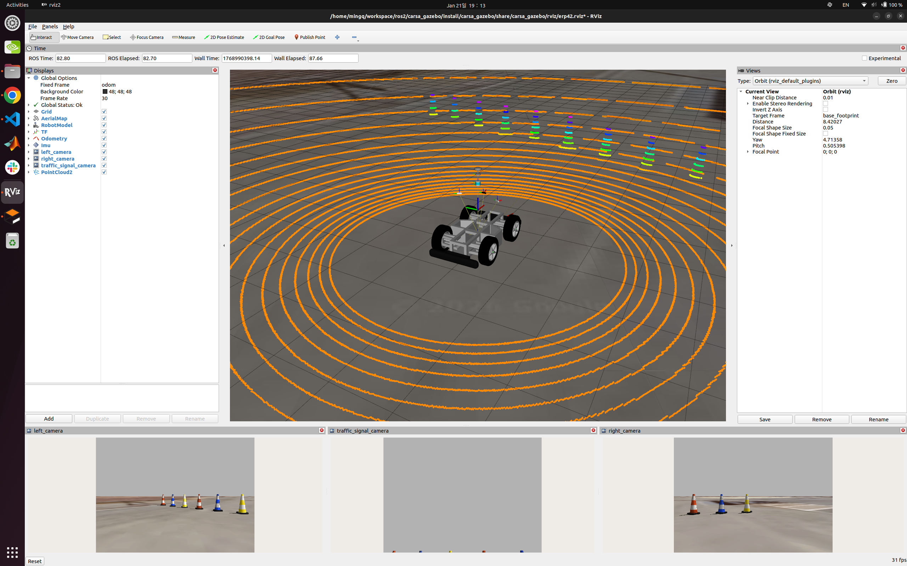

# CARSA Creative Mobility Gazebo Simulation

⚠️ **To use this package, the [erp42_ros](https://github.com/mingminQ/erp42_ros) package must be built and sourced in advance.**  

⚠️ **본 패키지를 사용하기 위해서는 [erp42_ros](https://github.com/mingminQ/erp42_ros) 패키지의 빌드 및 source가 선행되어야 한다.**  

</br>

The **carsa_gazebo** package provides an integrated set of Gazebo simulation resources based on the ERP42 platform for the **University Student Creative Mobility Competition.**  
This package includes **vehicle models, sensor models, and world files**, and is intended for validation and testing prior to real-vehicle experiments.  

**carsa_gazebo** 패키지는 **대학생 창작 모빌리티 대회**를 위한 **ERP42** 기반 **Gazebo 시뮬레이션 자원**을 통합 제공하는 패키지이다.  
본 패키지는 **차량 모델, 센서 모델, 월드 파일**을 포함하며, 실차 실험 이전 단계에서의 검증을 목적으로 한다.  

</br>

# Dependencies

The required dependencies can be automatically installed using **rosdep**.  
The following command should be executed from the **carsa_gazebo workspace root**.  

필요한 의존성은 **rosdep**을 통해 자동 설치할 수 있다.  
아래 명령어는 **carsa_gazebo 워크스페이스 루트**에서 실행된다.  

``` bash
$ rosdep install --rosdistro humble --from-paths . --ignore-src -r -y
```

</br>

# Gazebo World

This package uses map-based worlds to simulate real-road environments.  

본 패키지는 실제 도로 환경을 모사하기 위해 지도 기반 월드를 사용한다.

</br>

<div align="center">
  
</div>

</br>

## ERP42 Braking Simulation Plugin

To correctly simulate the braking behavior of the ERP42 in Gazebo, the following plugin must be included in the **.world** file.  

ERP42의 브레이크 동작을 Gazebo 상에서 정상적으로 시뮬레이션하기 위해 아래 플러그인이 **.world** 파일 내부에 반드시 포함되어야 한다.  

```xml
<plugin name="gazebo_ros_properties" filename="libgazebo_ros_properties.so">
    <ros>
        <namespace>/erp42</namespace>
    </ros>
</plugin>
```

</br>

## GPS Simulation Projection Origin

Since **carsa_gazebo** provides a GPS sensor by default, setting a geodetic projection origin for the World coordinate system is mandatory.  
Among the parameters below, **latitude_deg** and **longitude_deg** should be adjusted to match the experimental environment, while **heading_deg** must be kept at **180**.  

**carsa_gazebo**는 GPS 센서를 기본 제공하므로 World 좌표계에 대한 지구 좌표 투영 원점 설정이 필수이다.  
아래 항목 중 **latitude_deg**, **longitude_deg** 는 실험 환경에 맞게 조정하며, **heading_deg** 는 반드시 180으로 유지한다.  

```xml
<spherical_coordinates>
    <surface_model>EARTH_WGS84</surface_model>
    <latitude_deg>37.238973</latitude_deg>
    <longitude_deg>126.7729942</longitude_deg>
    <elevation>0</elevation>
    <heading_deg>180</heading_deg>
</spherical_coordinates>
```

</br>

## Google Map Tile (Optional)

The **kcity.world** file includes a Google Map Tile–based satellite imagery plugin.  
For more details, refer to [Gazebo Google Maptile](https://classic.gazebosim.org/tutorials?tut=static_map_plugin&cat=build_world).  

- Removal is recommended if GPU performance is insufficient.
- A Google API key is required to visually track the vehicle position.  

</br>

**kcity.world**에는 Google Map Tile 기반 위성 이미지 플러그인이 포함되어 있다.  
자세한 내용은 [Gazebo Google Maptile](https://classic.gazebosim.org/tutorials?tut=static_map_plugin&cat=build_world) 참고.  
- GPU 성능이 부족한 경우 삭제 권장
- 차량의 위치를 시각적으로 확인하려면 Google API Key 필요  

```xml
<plugin name='map' filename='libStaticMapPlugin.so'>
    <center>37.241 126.774</center>
    <world_size>750</world_size>
    <map_type>satellite</map_type>
    <api_key> <!-- YOUR OWN API KEY HERE --> </api_key>
    <use_cache>1</use_cache>
</plugin>
```

</br>

# Vehicle Description

The **carsa_gazebo** package provides the following sensors, and sensor mounting is configured by modifying **erp42.xacro**.  

carsa_gazebo는 다음 센서들을 제공하며, 센서 장착은 **erp42.xacro** 수정을 통해 이루어진다.

- **LiDAR** : Velodyne VLP 32-C
- **Camera** : Logitech C920, Logitech C930
- **GPS** : Ublox zed f9p
- **IMU** : Xsens MTi-3

</br>

<div align="center">
  
</div>

</br>

## ERP42 Vehicle Model

The default ERP42 vehicle model is included via the following xacro file.  

ERP42 기본 차량 모델은 다음 xacro를 통해 포함된다.  

### Xacro File : erp42_gazebo_control.xacro
```xml
<xacro:include filename="$(find erp42_gazebo)/urdf/erp42_gazebo_control.xacro"/>
```

### Macro : erp42_gazebo_control
```xml
<xacro:erp42_gazebo_control publish_odometry = "true"/>
```

### Publish Odometry Option

When validating localization algorithms, setting this option to **false** is recommended.
| Value     | Description |
| --------- | ---------------------------------------------------------------------------------------- |
| **true**  | Publishes Gazebo ground-truth odometry (including the `odom → base_footprint` transform) |
| **false** | Intended for validating localization nodes (e.g., GPS/IMU fusion) |

</br>

위치추정 알고리즘을 검증하는 경우 **false**로 설정하는 것을 권장한다.
| 값        | 설명                                                                    |
| --------- | ---------------------------------------------------------------------- |
| **true**  | Gazebo Ground Truth Odometry 발행 (`odom → base_footprint` Transform 포함) |
| **false** | 위치추정 노드(GPS/IMU Fusion 등) 검증용                                     |

</br>

# Sensors

All sensor xacro macros share the common parameters listed below.  
The **visualize** parameter applies only to vision-related sensors.
| Parameter          | Unit     | Description                                             |
| ------------------ | -------- | ------------------------------------------------------- |
| **parent_link**    | **-**    | Name of the parent link to which the sensor is attached |
| **sensor_name**    | **-**    | Name of the sensor link                                 |
| **visualize**      | **bool** | Visualizes the sensor’s sensing state in Gazebo         |
| **x y z**          | **m**    | Position offset from the **parent_link**                |
| **roll pitch yaw** | **deg**  | Orientation offset from the **parent_link**             |


</br>

모든 센서 xacro macro는 아래 공통 파라미터를 사용한다.  
**visualize**는 vision관련 센서에만 해당된다.  
| Parameter          | Unit     | Description                                      |
| ------------------ | -------- | ------------------------------------------------ |
| **parent_link**    | **-**    | 센서의 부모 링크 이름을 의미합니다.                     |
| **sensor_name**    | **-**    | 센서 링크 이름을 의미합니다.                           |
| **visualize**      | **bool** | 센서가 실제로 감지하고 있는 상태를 Gazebo에서 보여줍니다.   |
| **x y z**          | **m**    | **parent_link**로 부터 얼마나 떨어져 있는지를 의미합니다. |
| **roll pitch yaw** | **deg**  | **parent_link**로 부터 얼마나 회전해 있는지를 의미합니다. |

</br>

## LiDAR - Velodyne VLP-32C

### Xacro File : velodyne_vlp_32c.xacro
```xml
<xacro:include filename="$(find carsa_gazebo)/urdf/velodyne_vlp_32c.xacro"/>
```

### Macro : velodyne_vlp_32c
```xml
<!-- Example -->
<xacro:velodyne_vlp_32c 

    parent_link  = "base_link" 
    sensor_name  = "velodyne"
    visualize    = "false"
    x            = "0.0"
    y            = "0.0"
    z            = "1.0"
    roll         = "0.0"
    pitch        = "0.0"
    yaw          = "0.0"
    
/>
```

</br>

## Camera - Logitech C920 / C930

### Xacro File : logitech_c920.xacro
```xml
<xacro:include filename="$(find carsa_gazebo)/urdf/logitech_c920.xacro"/>
```

### Macro : logitech_c920
```xml
<!-- Example -->
<xacro:logitech_c920

    parent_link  = "base_link" 
    sensor_name  = "logitech_c920_traffic_light" 
    visualize    = "true"
    x            = "0.25"
    y            = "0.0"
    z            = "0.75"
    roll         = "0.0"
    pitch        = "-20.0"
    yaw          = "0.0"

/>
```

</br>

### Xacro File : logitech_c930.xacro
```xml
<xacro:include filename="$(find carsa_gazebo)/urdf/logitech_c930.xacro"/>
```

### Macro : logitech_c930
```xml
<!-- Example -->
<xacro:logitech_c930 

    parent_link  = "base_link" 
    sensor_name  = "logitech_c930_left" 
    visualize    = "true"
    x            = "0.0"
    y            = "0.40"
    z            = "0.75"
    roll         = "0.0" 
    pitch        = "0.0"
    yaw          = "30.0"

/>
```

</br>

## GPS - Ublox ZED-F9P (RTK Fixed)

### Xacro File : ublox_zed_f9p.xacro
```xml
<xacro:include filename="$(find carsa_gazebo)/urdf/ublox_zed_f9p.xacro"/>
```

### Macro : ublox_zed_f9p
```xml
<!-- Example -->
<xacro:ublox_zed_f9p 

    parent_link = "base_link" 
    sensor_name = "ublox_gps" 
    x           = "0.0" 
    y           = "0.0" 
    z           = "1.2"
    roll        = "0.0"
    pitch       = "0.0"
    yaw         = "0.0"

/>
```
</br>

## IMU : Xsens MTi-3

### Xacro File : xsens_mti3.xacro
```xml
<xacro:include filename="$(find carsa_gazebo)/urdf/xsens_mti3.xacro"/>
```

### Macro : xsens_mti3
```xml
<!-- Example -->
<xacro:xsens_mti3 

    parent_link = "base_link" 
    sensor_name = "xsens" 
    x           = "0.0" 
    y           = "0.0" 
    z           = "0.5"
    roll        = "0.0"
    pitch       = "0.0"
    yaw         = "0.0"

/>
```
</br>
